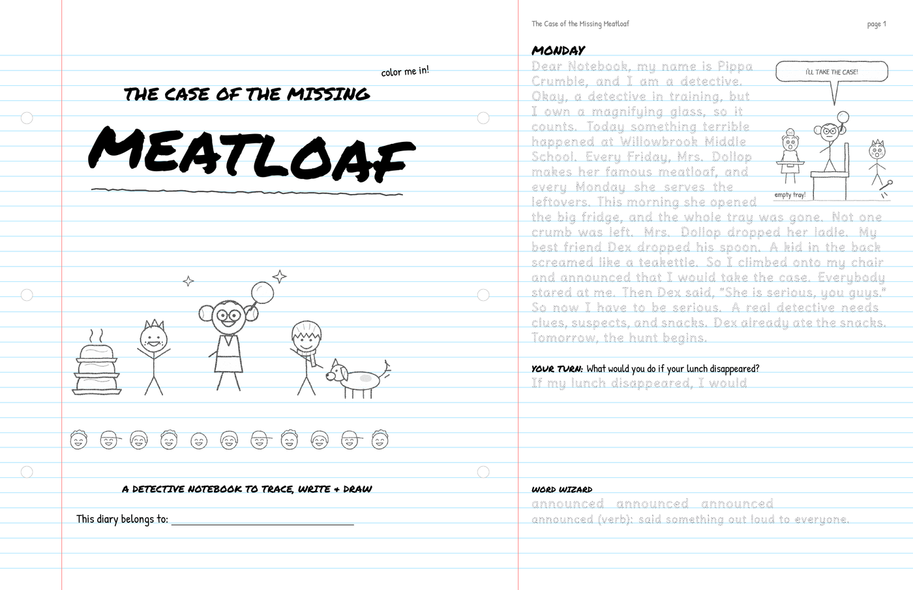

# Spark Labs plugins for Claude

Printable, playful learning materials made by Claude for kids, families and teachers.

| Plugin | What it makes |
|---|---|
| [Handwriting Storybook](plugins/handwriting-storybook) | A brand-new story as a printable handwriting book: trace, write, draw and learn a word on every page. |



## Install
**Claude Code:**
```
/plugin marketplace add skalyanaraaman/plugins
/plugin install handwriting-storybook@spark-labs
```
**claude.ai:** find "Handwriting Storybook" in the Claude directory (listing in review).

Each plugin README lists exactly what the plugin runs. More plugins (history worksheets, Tamil homework packets)
are coming.

## License
PolyForm Noncommercial 1.0.0. It is free for personal, family, classroom and school use. For commercial use, contact
hello@pori.dev. More at [pori.dev/learn](https://pori.dev/learn).
